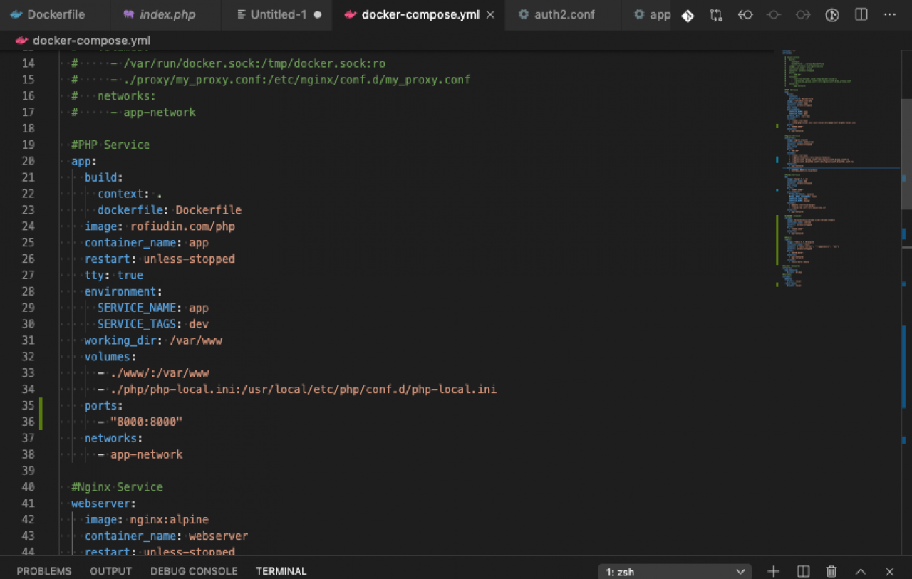

# Haruskah Belajar Docker?

Sebagai web developer, sebelum bisa bekerja, harus meng-install beberapa aplikasi atau service yang diperlukan. Contohnya, bagi PHP developer, aplikasi atau service yang harus di-install, antara lain :

<!-- more -->

<figure markdown="span">
  
  <figcaption markdown>
    Ilustrasi: file docker-compose
  </figcaption>
</figure>

<ul>
<li>PHP dan extension nya</li>
<li>Nginx web server</li>
<li>MySQL database</li>
<li>Redis</li>
<li>Memcache,</li>
<li>dan sebagainya</li>
</ul>

Jika pakai docker kita tinggal ketik perintah run, maka docker file / script yang sudah disiapkan akan menginstall service tersebut. Done.  Dan lebih penting adalah kita bisa belajar arsitektur microservices.  Apa itu microservices,&nbsp;nanti kita bahas. InsyaAllah.

