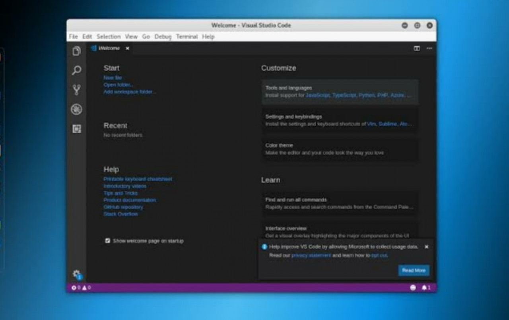

# Mengapa Pakai VSCode?

Kenapa ya?

Dulu lebih suka pakai sublime text, tapi sejak dari kantor dikasih laptop SSD, akhirnya beralih ke VSCode.

<!-- more -->

<figure markdown="span">
  
  <figcaption markdown>
    Ilustrasi: Microsoft VS Code
  </figcaption>
</figure>

Kalau secara tampilan sih lebih suka sublime text dengan monokai nya tapi kalo dari segi fitur, VSCode lebih mumpuni apalagi lisensinya yang free alias gratis.

Makin ke sini plugin nya juga semakin banyak.

Saran saja sih, kalau laptopnya belum SSD mending pakai sublime saja karena VSCode menurut saya saya cenderung berat.
