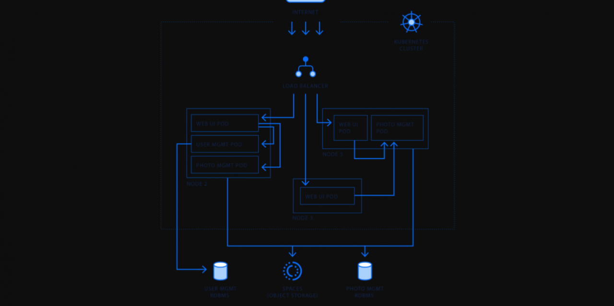

# Microservices Merubah Paradigma Berfikir

<strong>Apa sih bedanya microservices dengan monolith.</strong>

Begini, monolith itu berarti semua aplikasi dan service yang kita pakai semuanya berada 1 server atau mesin. Sedangkan microservices adalah membagi beberapa service ke beberapa mesin yang berbeda.

<!-- more -->

<figure markdown="span">
  
  <figcaption markdown>
    Ilustrasi: microservice
  </figcaption>
</figure>

<strong>Contoh monolith</strong> adalah local mesin atau komputer yang kita miliki atau 1 instance VPS untuk menjalankan aplikasi atau website yang kita buat. Di mana di 1 mesin terdapat banyak service seperti <strong>nginx, php-fpm, mysql,</strong> dan sebagainya.

<strong>Contoh microservice</strong> sederhana ketika kita menggunakan <strong>firebase</strong> sebagai database, atau menggunakan layanan <strong>mailgun</strong> untuk mengirim email. Database dan mengirim email melalui layanan pihak ketiga yang otomatis servernya berada di mereka bukan di tempat kita. Itu yang disebut microservices, membagi beberapa service atau aplikasi ke mesin yang berbeda.

Sudah ada gambaran?

Oke, next...

<strong>Kapan dan Mengapa kita menerapkan konsep microservices?</strong>

Kalau dari contoh firebase dan mailgun di atas, alasannya karena firebase dan mailgun menawarkan layanan lebih. Kita sederhanakan seperti ini. Intinya mesin atau server kita tidak mampu untuk menyediakan layanan tersebut secara sempurna dan pasti membutuh sumber daya tambahan. Dengan memisahkan fungsi database dan kirim email ke service terpisah, aplikasi di server kita menjadi lebih sederhana.

Jika aplikasi yang kita bangun sangat besar, dengan konsep microservices kita membagi aplikasi tersebut menjadi beberapa aplikasi yang lebih kecil sehingga mempermudah team kita untuk mengelola.

<blockquote>

Selanjutnya, kita akan lebih terarah ketika men-develop aplikasi, kira-kira apa saja yang bisa dibuat aplikasi terpisah dengan konsep microservices.

</blockquote>

Setelah kita mengetahui konsep microservices ini, ketika tahap perencanaan, kita sudah bisa memprediksi beberapa bagian di aplikasi kita yang akan dipisah dan dibuat aplikasi tersendiri ketika aplikasi tersebut sudah sangat besar dan butuh resource yang lebih besar lagi.
