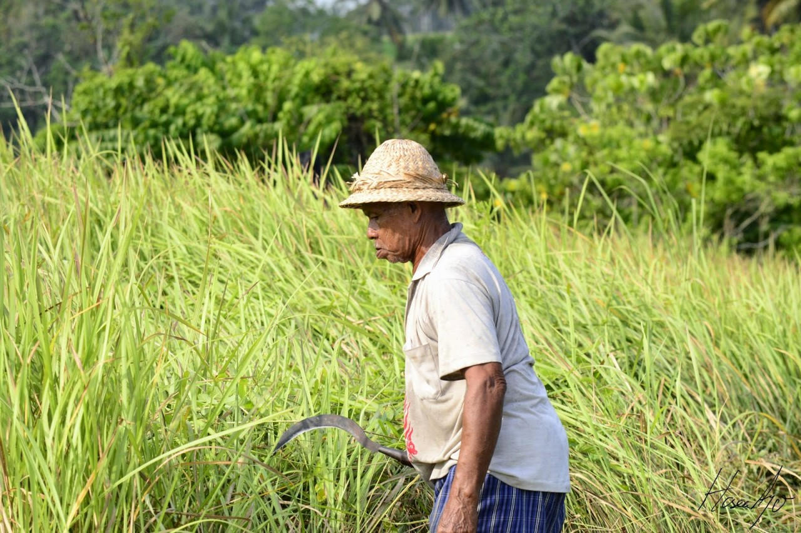

# Pak Tua dan Sehari yang Dilaluinya

Siang ini matahari bersinar terik, menyengat tanpa pedulikan aktifitas orang-orang di bawahnya. Seorang pria tua, sudah lebih dari paruh baya rupanya. Pakaiannya sederhana. Cuma kemeja biru lusuh dan celana pendek, memakai topi bulat sepintas mirip topi pramuka anak perempuan. Kulitnya coklat sawo mengisyaratkan kalau dia telah berkawan lama dengan mentari. Beliau berjalan menelusuri jalan dari perumahan yang satu ke perumahan yang lain.

<!-- more -->
<figure markdown="span">
  
  <figcaption markdown>__Ilustrasi / Foto credit__ : ==http://celotehsangmalaikatpengembara.blogspot.co.id/==</figcaption>
</figure>

Tujuan dia adalah mencari orang yang bisa memberinya pekerjaan. Umur tidak membuat dia surut untuk tetap bekerja. Pantang baginya untuk mengemis, mengharap kasihan orang. Berbekal arit, alat pemotong rumput dia menawarkan jasa untuk bersih-bersih halaman. Sudah banyak rumah yang dia lewati tetapi sepertinya ini bukan harinya, berangkat sejak pagi sampai matahari melewati pertengahan hari ini pun dia belum mendapat apa yang diharapkan.

Kira-kira sudah jam 2 siang sekarang dan dia berjalan menyasar di daerah pertokoan. Melewati berbagai toko dengan dahaga yang sangat. Lewatlah dia di sebuah rumah, mirip seperti deretan toko lainnya tetapi bukanlah toko. Berdiri dua orang penghuni rumah di samping pintu. Dia memperhatikan ke rumah tersebut dan kedua penghuni rumah pun memperhatikan pria tua itu lewat.  Kedua penghuni rumah adalah seorang suami istri yang siang memang sedang memperhatikan jalanan siang yang panas. Pria tua itu pun tak luput dari pandangan keduanya. Mereka perhatikan detil demi detil dan si istri pun berujar kepada suaminya ketika si pria tua telah melewati dan berjalan ke arah timur, "Orang tua itu pasti butuh kerja. Kasihan dia. Andaikan kita punya lebih uang, kita bisa mengupahinya buat bersih-bersih halaman belakang."

Tiba-tiba saja pria tua itu berada di depan rumah.  "I..Iya, ada apa pak?", tanya si suami.  "ha..us, ha..us.." ucap pria tua itu lirih sambil mengusap-usap lehernya. Entah karena usia atau rasa dahaga yang sangat sehingga suaranya terdengar lirih. Setelah dua kali berucap, maka si empunya rumah pun paham. Bergegas si istri mengambil aqua gelas dan mempersilakan pak tua itu masuk. Dengan hati-hati dan santun, pria tua itu meletakkan arit di samping pintu dan melepas sendalnya. Kemudian pria itu duduk.  "Pak, ini minumnya. Bapak suka tidak?", si istri memulai dengan menawarinya sebuah aqua gelas. "Tidak, saya tidak biasa minum itu..", balasnya. "Oh, ya sudah. Saya buatkan teh ya, Pak. Bagaimana?", si istri menawarkan lagi. "Iya, makasih nak." sahut pak tua setuju. Si istri ke dapur menyiapkan teh sementara si suami berbincang dengan pak tua itu. "Sebenarnya, Bapak ini dari mana? Kok bisa sampai ke sini.", tanya si suami. "Bapak ini mau nyari kerja. Berangkat dari rumah pagi tapi sampai sekarang belum dapat. Dan bapak mau pulang", sahut pak tua mulai bercerita.

Si istri datang membawa air teh hangat, setelah meminum beberapa teguk pak tua pun melanjutkan kisahnya. Rupanya bapak tua itu dari kandeman, sebelah timur kecamatan batang. Dia berjalan ke daerah sambong, menyusuri perumahan-perumahan di daerah itu sampai ke perumahan kalisalak untuk mencari pekerjaan. MasyaAllah. Ketika di kalisalak, dia sempat berhenti dan mencoba meminta bantuan ke bupati batang, rumahnya ada di daerah itu.

"Kata penjaganya, pak bupati masih di bandar jadi bapak gak dapat apa-apa di sana.", ceritanya. Setelah berkilo-kilo dia berjalan, dia memutuskan untuk pulang dan sampailah dia di rumah suami istri tersebut.  Setelah habis minuman teh yang dihidangkan, dia pun pamit. Dia merasa gak enak jika merepotkan lebih dari itu.

"Lha, memangnya bapak punya ongkos pulang?" tanya si suami. "Nih, masih ada seribu", jawabnya polos sambil mengeluarkan uang dari saku bajunya. "Kira-kira berapa ongkos sampe kandeman, Pak?", si suami tanya lagi. "Dua ribu, Nak", jawabnya.

Lalu, si suami meminta uang dua ribu rupiah kepada istrinya untuk diberikan kepada sang tamu.

Si istri lari ke kamar, membuka isi laci. Selembar uang sepuluh ribu dan tiga lembar uang seribu ada di sana. Kembali membuka laci yang lain tetapi tidak ada lainnya, cuma itulah uang yang mereka miliki pada saat itu. Segera si istri mengambil tiga lembar uang seribu dan memberikannya kepada pak tua.  "Alhamdulillah nak, terima kasih. Semoga Gusti Allah yang membalasnya", syukur pak tua itu. "Amin. Sama-sama, pak.", ucap pasangan itu. "Mari nak, bapak pamit pulang. Terima kasih".

<blockquote markdown>
Repost dari postingan jadul di blog saya dengan judul yang sama : ==http://inertperson.blogspot.co.id/2011/07/pak-tua-dan-sehari-yang-dilaluinya.html==
</blockquote>

