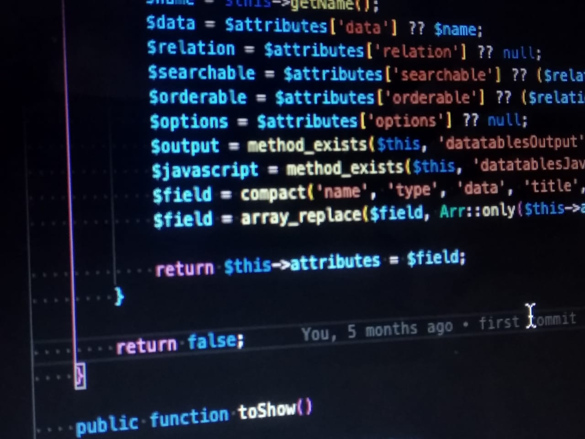

# Pentingnya Mengikuti Versi Terbaru Bahasa Pemrograman

Belum lama seorang rekan bertanya terkait error yang muncul di aplikasi yang kami bangun bersama. Kebetulan memang feature tersebut adalah bagian saya. Saya test di local saya tidak terjadi error apapun.

<!-- more -->

<figure markdown="span">
  
  <figcaption markdown>
    Ilustrasi: Laravel - Framework PHP
  </figcaption>
</figure>

Iseng saya tanya, "Versi berapa PHP di local mu bro?"

Ternyata dia memakai PHP versi 7.4, sedangkan aplikasi tersebut kami develop untuk server yang berjalan di versi 7.2. Oke, ketemu alasan kenapa muncul error.  Langsung saya cek, perubahan apa yang cukup major di versi 7.3 dan 7.4 yang kemungkinan menyebabkan error.  Ada 1 perubahan major yang menjadi penyebabnya, yaitu function <code><em>compact</em></code>

Seperti di dokumentasinya, 

<a href="https://www.php.net/manual/en/function.compact.php">https://www.php.net/manual/en/function.compact.php</a>

tertulis <em><strong>changelog</strong></em> untuk versi 7.3 :

<blockquote>
<strong>compact()</strong> now issues an E_NOTICE level error if a given string refers to an unset variable. Formerly, such strings have been silently skipped.
</blockquote>

Dulu masih sering lihat perubahan setiap versi baru muncul, tapi karena load kerjaan tambah banyak, saya ketinggalan melihat perubahan di 2 versi terakhir.
