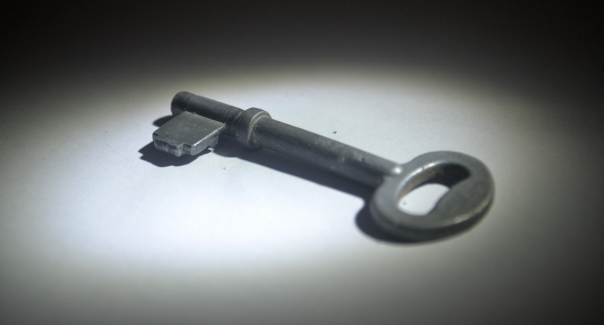

# Rahasia Kaya Raya Dari Orang Yang Sukses

Berkat rahmat Allah Yang Mahakuasa, saya dipertemukan dengan hamba-Nya yang satu ini. Beliau adalah seorang leader yang selalu mengayomi, memberikan bimbingan, semangat, inspirasi, ide dan gagasan segar. Beliau ekoseorang pemimpin yang mampu menggerakkan ratusan hingga ribuan anak buahnya. Beliau seorang guru yang memiliki lautan ilmu, yang selalu siap ditimba oleh anak-anaknya dan bagai tiada pernah habis.

<!-- more -->

<figure markdown="span">
  
  <figcaption markdown>
    Ilustrasi credit : ==https://pxhere.com/en/photo/496646==
  </figcaption>
</figure>

Saat ini beliau memiliki berbagai macam bidang usaha, di antaranya sebagai supplier dan distribusi alat dan produk kesehatan, puluhan hektar tambak, puluhan hektar ladang, berpuluh rumah kos, ruko, stand penjualan di mall, apartemen dan lain-lain. Pernah saya mencoba menghitung, penghasilan beliau bisa mencapai Rp 1 Milyar per bulannya. Sebuah pencapaian luar biasa bagi saya dan kebanyakan orang lain.  Pertemuan antara saya dan beliau yang saya ceritakan di bawah ini terjadi beberapa tahun yang lalu, di saat penghasilan beliau masih berkisar Rp 200 juta per bulan. Bagi saya, angka ini pun sudah bukan main dahsyatnya. Sengaja saya tidak menyebutkan namanya, karena cerita ini saya publish belum mendapatkan ijin dari beliau. Kita ambil wisdomnya saja ya.  Suatu hari, terjadilah dialog antara saya dengan beliau di serambi sebuah hotel di Bandung . Saya ingat, beliau berpesan bahwa beliau senang ditanya. Kalau ditanya, maka akan dijelaskan panjang lebar. Tapi kalau kita diam, maka beliau pun akan &ldquo;tidur&rdquo;. Jadilah saya berpikir untuk selalu mengajaknya ngobrol. Bertanya apa saja yang bisa saya tanyakan.  Sampai akhirnya saya bertanya secara asal, &ldquo;Pak, Anda saat ini kan bisa dibilang sukses. Paling tidak, lebih sukses daripada orang lain. Lalu menurut Anda, apa yang menjadi rahasia kesuksesan Anda?&rdquo;  Tak dinyana beliau menjawab pertanyaan ini dengan serius.  &rdquo; Ada empat hal yang harus Anda perhatikan,&rdquo; begitu beliau memulai penjelasannya.  <strong>RAHASIA PERTAMA</strong>  &ldquo;Pertama. Jangan lupakan orang tuamu, khususnya ibumu. Karena ibu adalah orang yang melahirkan kita ke muka bumi ini. Mulai dari mengandung 9 bulan lebih, itu sangat berat. Ibu melahirkan kita dengan susah payah, sakit sekali, nyawa taruhannya. Surga di bawah telapak kaki ibu. Ibu bagaikan pengeran katon (Tuhan yang kelihatan).  Banyak orang sekarang yang salah. Para guru dan kyai dicium tangannya, sementara kepada ibunya tidak pernah. Para guru dan kyai dipuja dan dielukan, diberi sumbangan materi jutaan rupiah, dibuatkan rumah; namun ibunya sendiri di rumah dibiarkan atau diberi materi tapi sedikit sekali. Banyak orang yang memberangkatkan haji guru atau kyainya, padahal ibunya sendiri belum dihajikan. Itu terbalik.  Pesan Nabi : Ibumu, ibumu, ibumu&hellip; baru kemudian ayahmu dan gurumu. Ridho Allah tergantung pada ridho kedua orang tua. Kumpulkan seribu ulama untuk berdoa. Maka doa ibumu jauh lebih mustajabah.&rdquo; Beliau mengambil napas sejenak.  <strong>RAHASIA KEDUA</strong>  &ldquo;Kemudian yang kedua,&rdquo; beliau melanjutkan. &ldquo;Banyaklah memberi. Banyaklah bersedekah. Allah berjanji membalas setiap uang yang kita keluarkan itu dengan berlipat ganda. Sedekah mampu mengalahkan angin. Sedekah bisa mengalahkan besi. Sedekah membersihkan harta dan hati kita. Sedekah melepaskan kita dari marabahaya. Allah mungkin membalas sedekah kita dengan rejeki yang banyak, kesehatan, terhindarkan kita dari bahaya, keluarga yang baik, ilmu, kesempatan, dan lain-lain.  Jangan sepelekan bila ada pengemis datang meminta-minta kepadamu. Karena saat itulah sebenarnya Anda dibukakan pintu rejeki. Beri pengemis itu dengan pemberian yang baik dan sikap yang baik. Kalau punya uang kertas, lebih baik memberinya dengan uang kertas, bukan uang logam. Pilihkan lembar uang kertas yang masih bagus, bukan yang sudah lecek. Pegang dengan dua tangan, lalu ulurkan dengan sikap hormat kalau perlu sambil menunduk (menghormat) . Pengemis yang Anda beri dengan cara seperti itu, akan terketuk hatinya, &lsquo;Belum pernah ada orang yang memberi dan menghargaiku seperti ini.&rsquo; Maka terucap atau tidak, dia akan mendoakan Anda dengan kelimpahan rejeki, kesehatan dan kebahagiaan.  Banyak orang yang keliru dengan menolak pengemis yang mendatanginya, bahkan ada pula yang menghardiknya. Perbuatan itu sama saja dengan menutup pintu rejekinya sendiri.  Dalam kesempatan lain, ketika saya berjalan-jalan dengan beliau, beliau jelas mempraktekkan apa yang diucapkannya itu. Memberi pengemis dengan selembar uang ribuan yang masih bagus dan memberikannya dengan dua tangan sambil sedikit membungkuk hormat. Saya lihat pengemis itu memang berbinar dan betapa berterima kasihnya.  <strong>RAHASIA KETIGA</strong>  &ldquo;Allah berjanji memberikan rejeki kepada kita dari jalan yang tidak disangka-sangka, &rdquo; begitu beliau mengawali penjelasannya untuk rahasia ketiganya. &ldquo;Tapi sedikit orang yang tahu, bagaimana caranya supaya itu cepat terjadi? Kebanyakan orang hanya menunggu. Padahal itu ada jalannya.&rdquo;  &ldquo;Benar di Al Quran ada satu ayat yang kira-kira artinya : Barangsiapa yang bertakwa kepada Allah niscaya diadakan-Nya jalan keluar baginya dan memberinya rejeki dari jalan/pintu yang tidak diduga-duga&rdquo; , saya menimpali (QS Ath Thalaq 2-3).  &ldquo;Nah, ingin tahu caranya bagaimana agar kita mendapatkan rejeki yang tidak diduga-duga? ,&rdquo; tanya beliau.  &ldquo;Ya, bagaimana caranya?&rdquo; jawab saya. Saya pikir cukup dengan bertaqwa, menjalankan perintah-Nya dan menjauhi larangan-Nya, maka Allah akan mengirim rejeki itu datang untuk kita.  &ldquo;Banyaklah menolong orang. Kalau ada orang yang butuh pertolongan, kalau ketemu orang yang kesulitan, langsung Anda bantu!&rdquo; jawaban beliau ini membuat saya berpikir keras. &ldquo;Saat seperti itulah, Anda menjadi rejeki yang tidak disangka-sangka bagi orang itu. Maka tentu balasannya adalah Allah akan memberikan kepadamu rejeki yang tidak disangka-sangka pula.&rdquo;  &ldquo;Walau pun itu orang kaya?&rdquo; tanya saya.  &ldquo;Ya, walau itu orang kaya, suatu saat dia pun butuh bantuan. Mungkin dompetnya hilang, mungkin ban mobilnya bocor, atau apa saja. Maka jika Anda temui itu dan Anda bisa menolongnya, segera bantulah.&rdquo;  &ldquo;Walau itu orang yang berpura-pura? Sekarang kan banyak orang jalan kaki, datang ke rumah kita, pura-pura minta sumbangan rumah ibadah, atau pura-pura belum makan, tapi ternyata cuma bohongan. Sumbangan yang katanya untuk rumah ibadah, sebenarnya dia makan sendiri,&rdquo; saya bertanya lagi.  &ldquo;Ya walau orang itu cuma berpura-pura seperti itu,&rdquo; jawab beliau. &ldquo;Kalau Anda tanya, sebenarnya dia pun tidak suka melakukan kebohongan itu. Dia itu sudah frustasi karena tidak bisa bekerja atau tidak punya pekerjaan yang benar. Dia itu butuh makan, namun sudah buntu pikirannya. Akhirnya itulah yang bisa dia lakukan. Soal itu nanti, serahkan pada Allah. Allah yang menghakimi perbuatannya, dan Allah yang membalas niat dan pemberian Anda.&rdquo;  <strong>RAHASIA KEEMPAT</strong>  Wah, makin menarik, nih. Saya manggut-manggut. Sebenarnya saya tidak menyangka kalau pertanyaan asal-asalan saya tadi berbuah jawaban yang begitu serius dan panjang. Sekarang tinggal satu rahasia lagi, dari empat rahasia seperti yang dikatakan beliau sebelumnya.  &ldquo;Yang keempat nih, Mas,&rdquo; beliau memulai. &ldquo;Jangan mempermainkan wanita&rdquo;.  Hm&hellip; ini membuat saya berpikir keras. Apa maksudnya. Apakah kita membuat janji dengan teman wanita, lalu tidak kita tepati? Atau jangan biarkan wanita menunggu? Seperti di film-film saja.  &ldquo;Maksudnya begini. Anda kan punya istri, atau suami. Itu adalah pasangan hidup Anda, baik di saat susah maupun senang. Ketika Anda pergi meninggalkan rumah untuk mencari nafkah, dia di rumah menunggu dan berdoa untuk keselamatan dan kesuksesan Anda. Dia ikut besama Anda di kala Anda susah, penghasilan yang pas-pasan, makan dan pakaian seadanya, dia mendampingi Anda dan mendukung segala usaha Anda untuk berhasil.&rdquo;  &ldquo;Lalu?&rdquo; saya tak sabar untuk tahu kelanjutan maksudnya.  &ldquo;Banyak orang yang kemudian ketika sukses, uangnya banyak, punya jabatan, lalu menikah lagi. Atau mulai bermain wanita (atau bermain pria, bagi yang perempuan). Baik menikah lagi secara terang-terangan, apalagi diam-diam, itu menyakiti hati pasangan hidup Anda. Ingat, pasangan hidup yang dulu mendampingi Anda di kala susah, mendukung dan berdoa untuk kesuksesan Anda. Namun ketika Anda mendapatkan sukses itu, Anda meninggalkannya. Atau Anda menduakannya. &ldquo;  Oh&hellip; pelajaran monogami nih, pikir saya dalam hati.  &ldquo;Banyak orang yang lupa hal itu. Begitu sudah jadi orang besar, uangnya banyak, lalu cari istri lagi. Menikah lagi. Merasa &ldquo;keadilan&rdquo; yang dikatakan Al Qur&rsquo;an hanya berupa keadilan material. Rumah tangganya jadi kacau. Ketika merasa ditinggalkan, pasangan hidupnya menjadi tidak rela. Akhirnya uangnya habis untuk biaya sana-sini. Banyak orang yang jatuh karena hal seperti ini. Dia lupa bahwa pasangan hidupnya itu sebenarnya ikut punya andil dalam kesuksesan dirinya,&rdquo; beliau melanjutkan.  Hal ini saya buktikan sendiri, setiap saya datang ke rumahnya yang di Waru Sidoarjo, saya menjumpai beliau punya 1 istri, 2 anak laki-laki dan 1 anak perempuan.  sumber:&nbsp;<a href="http://www.kaskus.co.id/showpost.php?p=107260485&amp;postcount=8" target="_blank" rel="noopener nofollow" data-lynx-mode="asynclazy" data-lynx-uri="https://l.facebook.com/l.php?u=http%3A%2F%2Fwww.kaskus.us%2Fshowpost.php%3Fp%3D107260485%26postcount%3D8&amp;h=ATMsTYOAnkU2bD_J5eCq78NTHD3cBe8L-_-He1xxvhuAhQqQY5ei9nZA4ls7lq7oMfxAEbyon3fDpABgLKYPGS3mM-BlWhf7Ps3Ta0S-edXa6Zdb1x9gAKmB5O3TsMp8rMY">http://www.kaskus.co.id/showpost.php?p=107260485&amp;postcount=8</a>  Semoga kita bisa mengambil pelajaran dan wisdom-nya.

<blockquote>

Pernah saya tulis di notes&nbsp;facebook saya dengan judul yang sama : <a href="https://www.facebook.com/notes/10150165669865133/">https://www.facebook.com/notes/10150165669865133/</a>

</blockquote>